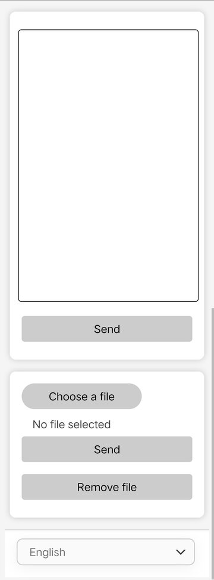

# Simple LAN-transfer: transfer text and files between PC and mobile device

- integrated server and client for LAN transfer
- simple and light
- files that have been transfer will not be stored locally, no need to delete manually after transfer
- safety transfer in LAN, no need to put data on the internet
- Multiple language support (English, 中文, 日本語, 한국어)


## Requirements

Node.js ([click here to download](https://nodejs.org/en/))


## Quick Start

After downloaded the source code, get into the project directory and use command:

```shell
node index.js
```

The normal output should be:

```shell
IP (Paste the IP into a browser to start): 192.168.50.50
Server has started.
```

`192.168.50.50` here is an example, it will changed depends on your local IP. 

After that, you can copy the IP and paste it to your favourite browser to start the app:


By default, the port 80 will be listened, so you can directly paste your IP to the browser. You can changed the port in [`server.js`]() if the port is already in used.


## Demonstration

The app is divide into 2 parts, **text transfer** and **file transfer**. 

The basic logic is that if you type in nothing (select no file) in the index page and click the `send` button directly, you will get the text (files) you just input (upload).

The procedure underneath shows how to use this app to transfer between PC and mobile devices:


### Text transfer


### File transfer


Here's the file transferred:




